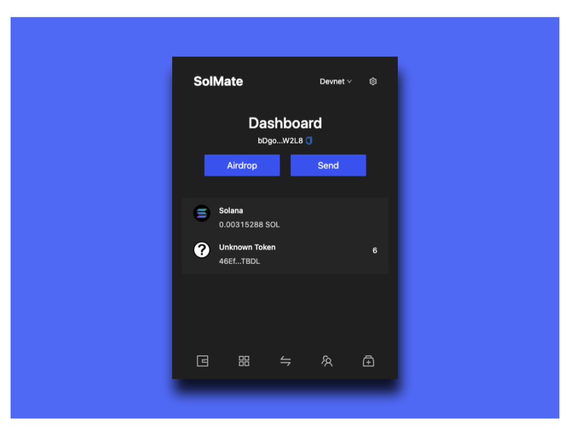

# Krypton

Introducing Krypton, a Solana smart contract wallet with multisig social recovery, eliminating fear of losing your private key and improving usability and security with advanced features



## ✨ Key Features

- Self custody without seed phrases (not good user experience)
- Social recovery with guardians (people, secondary wallet)
- Seamless integration with Yubikey as a physical wallet
- Setting transaction limit to prevent wallets being emptied
- Ability to interact with arbitrary smart contracts
- Customized avatar based on public key generated fully on-chain

## 🧑‍💻 Getting started

There are no formal blockchain or Web 3 prerequisites for this tutorial, but you should have some experience with [TypeScript](https://www.typescriptlang.org/) and [React](https://reactjs.org/). Having said that, you can certainly complete the tutorial if you at least know basic [JavaScript](https://developer.mozilla.org/en-US/docs/Web/JavaScript). You might just find it more difficult to follow the app's pre-built functionality.

Make sure you have [git](https://git-scm.com/book/en/v2/Getting-Started-Installing-Git), [Node](https://nodejs.org/en/) and [yarn](https://yarnpkg.com/getting-started/install) installed. Then clone the repo and run both the `yarn` and `npm install` command to install the app dependencies. Currently krypton supports node v16 so you need to run `nvm use 16`.

```
git clone https://github.com/krypton-wallet/chrome-extension.git
cd frontend
yarn && npm install && nvm use 16
```

## 💻 Build extension

Build the krypton extension with

```
nvm use 16
cd frontend
yarn build
```

You can load unpacked the /frontend/out folder in chrome extension developer mode and use it

## 📈 Flow Diagram


## High-level Overview

- Chrome extension interacts with Krypton wallet smart contract for all core functionality
- Uses Chrome local storage to cache current account results for better UX
- Interacts with the avatar smart contract for custom avatar generation and bloss library for Yubikey integration

### Startup

- On startup, create a new wallet on `devnet`
  - If testing on `mainnet-beta` is required, then just switch networks, fund the wallet, and continue using as normal
  - **NOTE**: you can skip the `devnet` creation step while testing by hardcoding a `mainnet-beta` prefunded keypair to initialize the account
- If creating a Yubikey account, ensure that a keypair is setup, `bloss-native` is installed, and the Yubikey is plugged in
- Guardian threshold is an important parameter that determines the number of guardian signatures required before you can recover your account (**NOTE**: Currently, it is implemented so that it cannot be updated anywhere else. However, the Krypton smart contract allows for it to be updated after startup as well)
- To initialize the account with a customized avatar that is generated fully on-chain, just check the corresponding box (**NOTE**: This is currently only available on `devnet`)

### Guardians

- Guardians refer to people/secondary wallets you can trust that would be responsible for recovering your account.
- To add a guardian,
  - Navigate to the guardians tab
  - Click on the Add button
  - Enter the `PublicKey` of the guardian account
- To remove a guardian,
  - Navigate to the guardians tab
  - Click on the Remove button next to the guardians
- Adding or removing a guardian does not notify the guardians themselves so it is important that you correctly verify that the `PublicKey`'s are valid.
- **[Recommended]**: Add a secondary wallet as a guardian to prevent any collusion or scammers trying to take over your account by falsifying a recovery

### Recovery

- If you lose your account, the recovery process is really simple
- On a new device, create a new account
- Navigate to the recovery tab and start the recovery for the account `PublicKey` lost
- This generates a link that you can copy and send to your guardians
- The guardians then navigate to this link and sign a message attesting to the fact that the recovery is valid
- While the guardians sign, you can use the new account without any constraints and monitor the recovery progress by checking how many signatures are left in the recovery tab
- Once the required number of signatures (`>= recovery threshold`) are obtained, you can complete the recovery
- This transfers ownership of your previous account into your new account (and `Keypair`). This ensures that the old `PublicKey` is not "lost" but instead only accessible using the new account as the authority

### Signing Transactions

- All Krypton smart contract instructions like sending native SOL, sending tokens, adding/removing guardians, etc., work as expected are signed by the `Keypair`
- To support the wallet standard, the `PublicKey` that is exposed is expected to be a signer. However, in Krypton's case, the exposed `PublicKey` is a PDA and not a keypair. Thus, we solve this problem by performing a transaction rewrite by wrapping the instruction with a CPI. This gives the instruction the impression that the instruction is being signed by the PDA when it is actually being signed by `Keypair`.
- As all transactions are being signed by the `Keypair`, we require it to be able to pay the transaction costs. To improve UX, we automatically refill your `Keypair` to 0.2 SOL (from the `PublicKey`) when its balance is below 0.1 SOL giving the impression that the `PublicKey` is funding the transaction

### Yubikey Integration

- Chrome extension interacts with Yubikey using `bloss-js` (`bloss-native` should be installed on client device). Details given below

#### Bloss

- Bloss is a web library for OpenPGP smart card signing that is used to allow the extension to communicate with the connected Yubikey on your device using CCID
- It has functions to list all the connected Yubikey and their `pubkeyBytes` (among others) and to sign a message using the Yubikey's PGP signing key and signing algorithm

#### Yubikey Setup Instructions

- **Set up a Solana keypair in the Yubikey**: This link has instructions on how to set up a ed25519 keypair on the Yubikey: https://zach.codes/ultimate-yubikey-setup-guide/
- **`bloss-native`**: Clone the bloss library and run `./install.sh <demo wallet Chrome extension ID>` to set up `bloss-native` that the extension uses to communicate with the local Yubikeys

#### Signing Transactions with Yubikey

- To sign a transaction, ensure `bloss-native` is setup and the Yubikey corresponding to the account is plugged in.
- If PIN prompt is enabled, a PIN entry modal pops up where you can enter your PIN. (**NOTE**: For better UX, this PIN is cached in a local React state so that it does not require you to enter your PIN multiple times. Storing in a local React state also ensures that the user's privacy is not breached)
- If Touch is enabled, touch the Yubikey to sign the transaction
